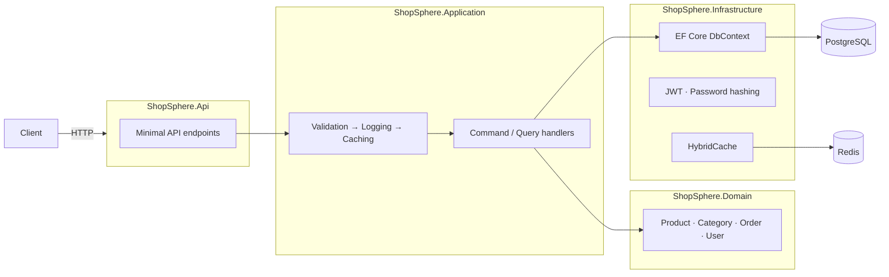

# ShopSphere API

[](https://github.com/ebrahimmorkas/shopsphere-api/actions/workflows/ci.yml)


A production-grade e-commerce REST API built with **ASP.NET Core 10** and **Clean Architecture**. It covers the problems real backends face: authentication with token rotation, overselling under concurrency, cache invalidation, observability and automated testing against a real database.

---

## Highlights

| Area | What's implemented |
|---|---|
| **Architecture** | Clean Architecture (Domain → Application → Infrastructure → API), DDD aggregates, Result pattern instead of exceptions for expected failures |
| **CQRS** | Lightweight command/query handlers with **Scrutor** decorators for validation, logging and caching (no MediatR dependency) |
| **Persistence** | EF Core 10 + PostgreSQL, complex types for value objects, snake_case naming, migrations, **optimistic concurrency via `xmin`** |
| **Security** | JWT access tokens, **refresh token rotation with reuse detection**, PBKDF2-SHA512 hashing, role-based policies, resource-based authorization |
| **Performance** | **HybridCache** (in-memory L1 + Redis L2) with automatic invalidation from an EF Core `SaveChangesInterceptor` |
| **Resilience** | Rate limiting (global + strict auth policy), connection retries, health checks with timeouts |
| **Observability** | Serilog structured logs, **OpenTelemetry** traces and metrics, Aspire dashboard |
| **API** | Minimal APIs, versioned routes, RFC 9457 ProblemDetails, OpenAPI + Scalar UI |
| **Testing** | 42 unit tests + 20 integration tests using **Testcontainers** (real PostgreSQL), including a concurrent-purchase test |
| **DevOps** | Multi-stage Dockerfile on a chiseled non-root image, docker-compose, GitHub Actions CI |

## Architecture



Dependencies point inwards: the Domain has no dependencies, the Application layer depends only on the Domain, and Infrastructure and Api plug in at the edges.

```
src/
  ShopSphere.Domain          Entities, value objects, domain events, errors
  ShopSphere.Application     Use cases (commands/queries), validators, pipeline decorators
  ShopSphere.Infrastructure  EF Core, migrations, auth, caching, health checks
  ShopSphere.Api             Endpoints, ProblemDetails, OpenAPI, rate limiting, telemetry
tests/
  ShopSphere.Domain.UnitTests
  ShopSphere.Application.UnitTests
  ShopSphere.Api.IntegrationTests   WebApplicationFactory + Testcontainers
```

## Getting started

### Option 1: everything in Docker

```bash
docker compose up --build
```

| URL | What |
|---|---|
| http://localhost:8080/scalar/v1 | Interactive API docs |
| http://localhost:8080/health/ready | Readiness probe |
| http://localhost:18888 | Aspire dashboard (traces, metrics, logs) |

A demo admin is seeded: `admin@shopsphere.dev` / `Admin123!`

### Option 2: run the API locally

Requires the [.NET 10 SDK](https://dotnet.microsoft.com/download).

```bash
docker compose up -d postgres redis aspire-dashboard
dotnet run --project src/ShopSphere.Api
```

In Development, migrations are applied and the admin account is seeded automatically.

### Run the tests

```bash
dotnet test
```

Integration tests start a disposable PostgreSQL container, so Docker must be running.

## API overview

All routes are under `/api/v1`.

| Method | Route | Access |
|---|---|---|
| POST | `/auth/register` · `/auth/login` · `/auth/refresh` | Public (rate limited) |
| GET | `/auth/me` | Authenticated |
| GET | `/categories` · `/products` · `/products/{id}` | Public |
| POST/PUT/DELETE | `/categories/**` · `/products/**` | Admin |
| POST | `/orders` | Customer |
| GET | `/orders` · `/orders/{id}` | Owner / Admin |
| POST | `/orders/{id}/cancel` | Owner / Admin |
| POST | `/orders/{id}/pay` · `/ship` · `/deliver` | Admin |

Product search supports `search`, `categoryId`, `minPrice`, `maxPrice`, `sortBy` (`name`/`price`/`created`), `sortOrder`, `page` and `pageSize`.

## Design decisions

- **Result pattern over exceptions.** Expected failures (not found, validation, conflicts) are values mapped to ProblemDetails in one place. Exceptions are reserved for truly exceptional cases.
- **No MediatR.** Its licence changed in 2025. Plain handler interfaces plus Scrutor decorators give the same pipeline with explicit dependencies.
- **`DbContext` as the unit of work.** EF Core already implements the Repository and Unit of Work patterns, so handlers use `IApplicationDbContext` directly instead of thin wrappers.
- **Overselling protection.** Stock is decremented inside the `Product` aggregate, and PostgreSQL's `xmin` acts as a row version. Concurrent purchases of the last item produce a `409` instead of negative stock, as the integration tests prove.
- **Domain events are dispatched before commit**, so side effects (for example restocking on cancellation) are atomic with the change that caused them.
- **Cache invalidation lives in infrastructure.** A `SaveChangesInterceptor` evicts cache keys for every changed product or category, so no handler can forget to do it.
- **Refresh token reuse detection.** Presenting a rotated token revokes all of the user's sessions, which limits the damage of a stolen token.

## License

[MIT](LICENSE)
